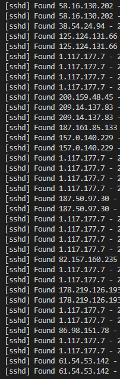

# fail2ban
前几天畅总跟我说：`你直接用ssh登录真的不怕扫吗？`  
然后我就愣愣的去  
```bash
 lastb
```
结果：**坏了**  
从早到晚一直被扫  
然后就赶快来补上fail2ban  

## 安装  
```bash
 yum -y install fail2ban
```
### 环境
CentOS 7.6.1810 x86_64(Py3.7.9)  

正常安装后fail2ban配置文件会存在于 `/etc/fail2ban` 中，其中 `jail.conf` 为主要的配置文件，很多说明也都在此文件中。  
相关的匹配规则则在 `filter.d` 目录中，其他文件目录是很少用到的。  
还有一份 `fail2ban.sock` 文件会存在于 `/var/run/fail2ban` 中。  

## 配置
```bash
 cd /etc/fail2ban
```
在 `/etc/fail2ban` 中，就别直接使用 `jail.conf` ，还是新建一个比较安全。  
所以直接  
```bash
 vim jail.local
```
```bash
 [DEFAULT]
 # 忽略的IP列表,不受设置限制
 ignoreip = 127.0.0.1/8 
 
 # 被封IP禁止访问的时间，单位是秒  
 # 24h
 bantime = 86400
 
 # 检测时间，在此时间内超过规定的次数会激活fail2ban，单位是秒 
 # 1min  
 findtime = 60
 
 # 允许错误登录的最大次数
 maxretry = 5
 
 # 日志修改检测机制（gamin、polling和auto这三种）详细说明查看conf
 backend = auto 
 
 # 定义日志级别，默认
 loglevel = 3 
 
 # 定义 fail2ban 日志文件
 logtarget = /var/log/fail2ban.log 
 
 # sock 文件存放位置，默认
 socket = /var/run/fail2ban/fail2ban.sock 
 
 # pid 文件存放位置，默认
 pidfile = /var/run/fail2ban/fail2ban.pid 
 
 # 邮件通知参数
 sendmail-whois[name=SSH, dest=you@example.com, sender=fail2ban@example.com,sendername="Fail2Ban"]
 # dest为收件人地址           ## sender为发件人地址 
 # 腾讯云还需要自己设置端口号，sendmail自带端口号好像用不了
 
 [sshd]
 # 激活，表示开启监控
 enabled = true

 # 规律规则名，对应filter.d目录下的sshd.conf
 filter = sshd 
 banaction = firewallcmd-new

 # 检测的系统的登陆日志文件。这里要写sshd服务日志文件
 logpath = /var/log/secure 

 # 禁止用户IP访问主机12小时
 bantime = 43200 

 # 在1分钟内内出现规定次数就开始工作
 findtime = 60 
 
 # 允许5次密码验证失败
 maxretry = 5 
 port = 22
 
 [sshd-ddos]
 enabled = true
```

## 启动及状态
```bash
 #启动
 systemctl start fail2ban

 #重新启动
 systemctl restart fail2ban

 #停止
 systemctl stop fail2ban

 #开机启动
 systemctl enable fail2ban
 
 #查看fail2ban状态，可以看到被ban IP，其中sshd为名称，也可以不填
 fail2ban-client status sshd
 
 #删除被ban IP
 fail2ban-client set sshd delignoreip 192.168.1.1

 #查看日志
 tail  /var/log/fail2ban.log

 #查看被拦截的ip
 iptables -nvL
```

## 结果
刚搞好fail2ban没几分钟，就已经逮到好几条记录了  


## Better
*证书登录*当然是更好的办法咯  
众所周知，**私钥**是更安全的登录方式，但是目前就接入github用上了，自己电脑上都没保存hhhhh  
找个借口：~~设备太多.~~  
自己给自己挖了个坑，后面补上。